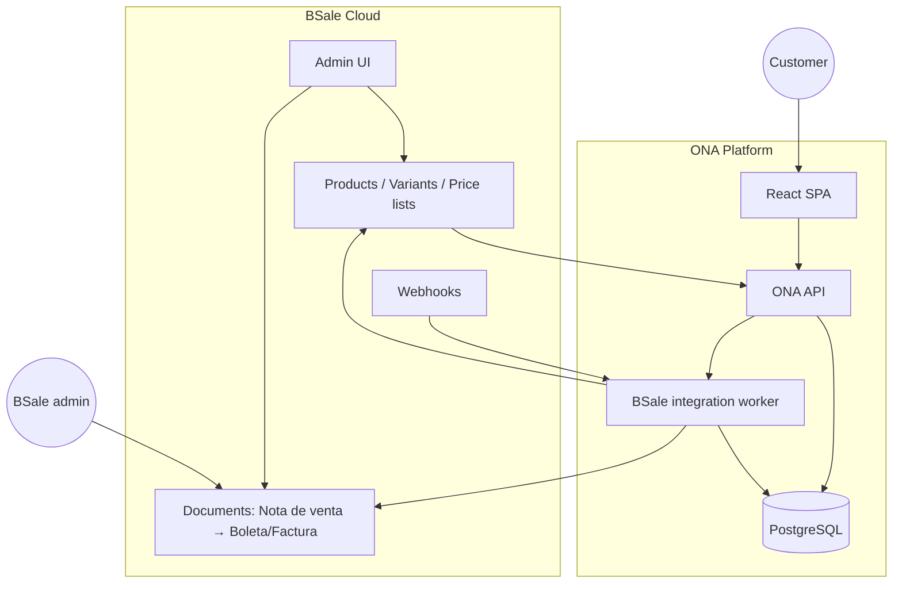
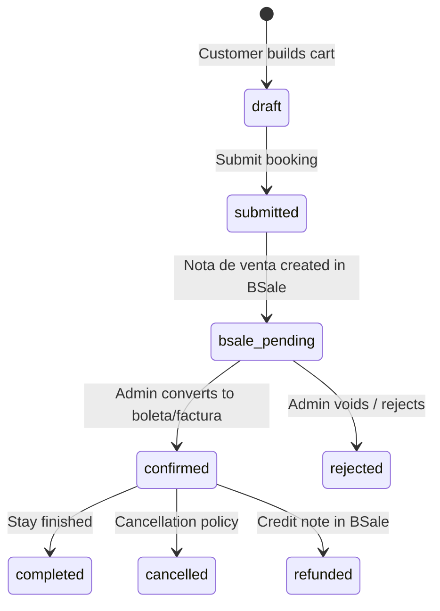

# ONA Experiences — BSale-centric architecture plan

**Status:** Draft — May 2026  
**Audience:** Product, engineering, operations  
**References:** [.cursor/skills/bsale-api/SKILL.md](../.cursor/skills/bsale-api/SKILL.md), [BSale API docs](https://docs.bsale.dev/first-steps), current frontend (`src/data.js`)

---

## 1. Executive summary

The product model shifts from **ONA owning lodges, guides, prices, and fiscal sync** to **BSale owning sellable services (products/variants, prices, and fiscal documents)** while **ONA owns discovery, reservations, and operational rules**.

| Layer | Owner | Role |
|-------|--------|------|
| **Catalog & pricing** | BSale (admin UI) | Lodge packages, guide services, taxes, price lists |
| **Fiscal sale** | BSale | Nota de venta → boleta/factura after admin confirmation |
| **Marketing & UX** | ONA web | Map, galleries, directory, booking UI |
| **Reservations & rules** | ONA API + DB | Dates, guide–lodge rules, commission, customer accounts |
| **Bridge** | ONA integration service | BSale API + webhooks |

**Recommended sale flow:** Customer books on the website → ONA creates a **nota de venta** (pre-sale document) in BSale with catalog `variantId` lines → Admin confirms in BSale (UI or API) → BSale emits **boleta/factura** → Webhook notifies ONA → Reservation marked sold/paid.

---

## 2. What changed vs the original plan

The earlier model (see skill `ona-mapping.md`) assumed:

- Lodges/guides live in PostgreSQL with images and slugs.
- BSale only receives **clients** and **invoices after payment**.
- Prices could be free-text on documents (`comment` lines).

The **new model** adds:

- Sellable **services are created in BSale** (`classification: 1`).
- The website **lists BSale products** (filtered/mapped to lodges and guides).
- **Confirmation happens in BSale** before the fiscal sale is final.
- ONA still needs a database for things BSale does not model well (see §6).

---

## 3. Target system architecture

### 3.1 BSale catalog design (admin-managed)

Create **services** in BSale (`classification: 1`, `stockControl: 0` for most lodge/guide offers). Group them under **product types** named `LODGE` and `GUIDE` in BSale admin (matching `BSALE_LODGE_PRODUCT_TYPE_NAME` / `BSALE_GUIDE_PRODUCT_TYPE_NAME` in the API).

| Product family | BSale product type | Example BSale product | Variants |
|----------------|----------------------|-------------------------|----------|
| Lodge stay | `LODGE` | `Bio Bío Lodge — Estadía` | One variant per lodge service |
| Guide service | `GUIDE` | `Guía — Juan Pérez` | One variant per guide service |
| Platform (optional) | (separate type or product) | `ONA — Comisión plataforma` | Commission line |

**Mapping table in ONA** (required):

| ONA field | BSale field | Purpose |
|-----------|-------------|---------|
| `lodges.bsale_product_id` / `bsale_variant_id` | product / variant `id` | Link directory card to catalog |
| `guides.bsale_variant_id` | variant `id` | Guide service line |
| `lodges.slug`, geo, gallery | *not in BSale* | Website presentation |

**API catalog flow:** `GET /product_types.json?name=LODGE` → `GET /product_types/{id}/products.json` → `GET /products/{id}/variants.json` (one variant per service product).

Prices: maintain in BSale **price lists** ([listas de precio](https://docs.bsale.dev/listas-de-precio)); ONA reads `GET /price_lists/{id}/details.json?expand=variant`.

### 3.2 Website (React — current repo)

**Keep in ONA** (from `src/data.js` today):

- Lodge/guide **marketing** data: photos, map coordinates, zones, representative, ratings (until reviews are server-backed).
- Map (Leaflet), directory UX, filters.

**Load from ONA API** (which caches BSale):

- **Bookable offers**: variant name, net/gross price, taxes.
- **Availability** (from ONA DB — §6.1).

**New flows:**

1. Browse lodges/guides (static/enriched directory).
2. Select lodge package + optional guide variant + date range.
3. Checkout: customer profile (RUT, address) → create reservation `pending`.
4. API creates BSale client + **nota de venta** with `variantId` lines + `salesId: ONA-RES-{uuid}`.
5. Show status: “Pending confirmation by ONA / lodge.”
6. On webhook (or poll): show PDF link (`urlPdf`) when sale document exists.

### 3.3 ONA API (new backend)

Suggested modules:

| Module | Responsibility |
|--------|----------------|
| `catalog` | Sync/cache products, variants, prices from BSale; expose to web |
| `directory` | Lodges/guides presentation + `bsale_variant_id` joins |
| `reservations` | CRUD, status machine, date validation |
| `customers` | Auth (OAuth/JWT), profile, map to BSale `clients` |
| `bsale` | Client upsert, document create, webhook handler |
| `admin` | Retry sync, override status |

**Reservation status machine (proposed):**

### 3.4 BSale document workflow (core integration)

| Step | Actor | BSale action | API |
|------|--------|--------------|-----|
| 1 | ONA | Upsert client | `POST/PUT /clients`, `GET ?code={rut}` |
| 2 | ONA | Create **nota de venta** | `POST /documents` with `documentTypeId` = nota de venta, `details[].variantId`, `salesId` |
| 3 | Admin | Review pre-sale in BSale UI | — |
| 4 | Admin | Convert to boleta/factura | **Often UI**; API option: new `POST /documents` with `details[].detailId` from pre-sale lines ([documentos — a partir de existente](https://docs.bsale.dev/documentos)) |
| 5 | BSale | Emit DTE, SII | `declareSii: 1` on final sale doc |
| 6 | ONA | Update reservation | Webhook `topic: Document` or poll `GET /documents/{id}` |

Store on reservation:

- `besale_presale_document_id` (nota de venta)
- `besale_document_id` (final sale)
- `besale_sync_status`, `besale_payload`

---

## 4. Implementation phases

### Phase 1 — Catalog read path (2–3 weeks)

- BSale sandbox: create sample lodge + guide services and price list.
- ONA API: sync job for products/variants/prices; cache in DB or Redis (TTL 15–60 min).
- Map 3–5 lodges from `src/data.js` to BSale variant IDs (manual table).
- Frontend: “Book” panel showing BSale price on lodge detail (read-only).

### Phase 2 — Reservation + nota de venta (2–3 weeks)

- Auth + customer profile (RUT validation).
- `POST /reservations` → BSale client + nota de venta.
- Reservation list for customer (“pending confirmation”).

### Phase 3 — Confirmation + webhooks (1–2 weeks)

- Request BSale webhook activation ([webhooks](https://docs.bsale.dev/webhooks)) for `Document` topic.
- Handler: if `salesId` matches ONA reservation → advance status, store PDF URLs.
- Admin dashboard: reservation ↔ BSale document links.
- Document **conversion** playbook for admins (UI steps + optional API automation).

### Phase 4 — Hardening (ongoing)

- Idempotency (`salesId`), retries (`besale_sync_events`).
- Credit notes on cancel ([devoluciones](https://docs.bsale.dev/CL/devoluciones)).
- Payment gateway (Webpay) if needed — **outside** BSale catalog (§6).

---

## 5. BSale API capability matrix

### 5.1 Supported well (use BSale)

| Capability | BSale API | Notes |
|------------|-----------|--------|
| Service catalog CRUD | `POST/PUT /products`, `/variants` | Admin prefers UI; API for bulk import |
| List catalog | `GET /products`, `/variants`, price list details | Paginate; cache aggressively |
| Prices & taxes | Price lists + `product_taxes` | Reference `priceListId` on documents |
| Customer master | `/clients` | RUT in `code` |
| Pre-sale order | `POST /documents` (nota de venta type) | Use `variantId` lines |
| Final sale | `POST /documents` (boleta/factura) | After confirmation |
| Idempotent external ref | `salesId` on documents | Tie to ONA reservation UUID |
| Sale from pre-sale lines | `details[].detailId` | Copy from nota de venta |
| Fiscal PDF/XML URLs | Document response | Customer self-service |
| Inbound events | Webhooks | Must request activation |
| Credit notes | Devoluciones API | Refunds |

### 5.2 Partial / awkward (ONA must supplement)

| Capability | Limitation | Mitigation |
|------------|------------|------------|
| **“Admin confirms order”** | No dedicated “approval” resource; conversion is a **document type transition** (nota de venta → boleta/factura), often done in BSale UI | Webhook on new document; train admins; optionally automate via API `detailId` |
| **Product ↔ lodge/guide identity** | BSale has no lodge entity | ONA mapping table + SKU convention |
| **Rich merchandising** | Products lack gallery/geo/specialty | ONA `lodges` / `guides` tables for UX only |
| **Date-range booking** | Stock is units, not calendar nights | ONA `reservations` + availability tables |
| **Guide only at affiliated lodge** | No native rule | ONA API validation before creating nota de venta |
| **Platform commission (10%)** | No built-in rule | ONA calculates; add commission variant line or separate document |
| **Multi-line carts** | Supported | Multiple `details` variants in one nota de venta |
| **Online card payment** | BSale records `payments` on documents; **Webpay/Stripe is separate** | Payment provider → then mark paid + optional BSale `payments` node |
| **Webhook granularity** | Fires on many document events | Filter by `documentTypeId`, `salesId`, `officeId` |

### 5.3 Not realistically provided by BSale API (ONA must own)

| Capability | Why |
|------------|-----|
| **Interactive map & directory UX** | Not a commerce API concern |
| **Customer OAuth / JWT sessions** | Use ONA auth; sync client to BSale |
| **Reviews & ratings** | No review resource; keep ONA or third party |
| **Lodge subscription billing** ($200k/month platform fee to lodges) | Different B2B billing model; separate BSale products/invoices or manual |
| **Season calendars** (Oct–Apr) | Business rule in ONA |
| **Email booking notifications** | ONA sends; BSale `sendEmail: 1` only for DTE to client |
| **Real-time “is this guide free on date X?”** | Requires ONA availability engine |
| **Guest checkout without RUT** | Chilean invoicing eventually needs RUT; boleta may allow less data |
| **Full replacement of ONA admin** | Lodge managers, affiliation, reservation history stay in ONA |

---

## 6. Can everything be done via BSale API?

**No.** BSale is an **ERP + Chilean electronic invoicing** platform, not a reservation or experience marketplace.

**Yes, the fiscal and catalog spine can be BSale-centric**, if ONA accepts:

1. A **thin operational database** (reservations, availability, mappings, users).
2. **Admin confirmation** in BSale (UI at first; API later).
3. **Marketing content** duplicated/mapped between ONA and BSale SKUs.

The **minimum ONA backend** is still required for any serious booking product.

---

## 7. Risks and troubles to expect

### 7.1 Product & catalog

| Risk | Impact | Mitigation |
|------|--------|------------|
| Admin renames/deactivates variant in BSale | Broken booking links | Sync job; validate `state=0` before sell; alert on missing variant |
| No lodge/guide in BSale taxonomy | Messy catalog | Strict SKU + dynamic attributes; document naming standards |
| Price list out of sync | Wrong quote at checkout | Refresh cache; show “price confirmed at booking” disclaimer |
| Pagination (50 max) | Slow full catalog sync | Nightly sync + incremental webhooks (`Product`, `Price` topics) |

### 7.2 Reservation ↔ document

| Risk | Impact | Mitigation |
|------|--------|------------|
| Admin forgets to convert nota de venta | Reservation stuck `bsale_pending` | Admin queue in ONA; reminders; SLA |
| Double fiscal documents | Accounting error | Always set `salesId`; check before `POST` sale doc |
| `declareSii` rejection (`informedSii: 2`) | No valid DTE | Retry rules; ops alert; customer messaging |
| Conversion only in UI | Hard to automate E2E | Pilot API `detailId` flow; document admin SOP |

### 7.3 Technical / integration

| Risk | Impact | Mitigation |
|------|--------|------------|
| Webhooks not enabled by default | ONA out of sync | Request activation early; fallback poll `GET /documents?salesId=` |
| Webhook fires for unrelated docs | Wrong status updates | Strict `salesId` prefix filter |
| Token in header leaked in logs | Security | Redact in `besale_sync_events` |
| Rate limits / latency | Slow checkout | Server-side only; never call BSale from browser |
| Sandbox ≠ production IDs | Deploy bugs | Separate env config per stage |

### 7.4 Business / legal

| Risk | Impact | Mitigation |
|------|--------|------------|
| Factura requires complete client data | Checkout blocked | Collect RUT/address before submit |
| Foreign anglers | Export / `isForeigner` rules | Map `tax_id_type`; accountant sign-off |
| Commission disputes | Lodge vs ONA revenue | Separate line items; clear contracts |
| Cancel/refund after DTE | Credit note complexity | Devoluciones process + reservation `refunded` |

### 7.5 UX / product

| Risk | Impact | Mitigation |
|------|--------|------------|
| Customer expects instant confirmation | Support load | Clear copy: “subject to lodge confirmation” |
| BSale PDF is fiscal, not itinerary | Confusion | ONA confirmation email with dates/guide/lodge |
| Ratings in `localStorage` | Trust gap | Phase later: ONA `reviews` table |

---

## 8. Data model adjustments (ONA DB)

Keep a **slim** schema; BSale is catalog + documents.

**Still in ONA:**

- `users`, `customers`, `oauth_identities`
- `lodges`, `guides`, `lodge_images`, `guide_images` (presentation)
- `guide_lodge_affiliations`
- `reservations`, `reservation_guides`
- `reservation_status_history`
- `bsale_sync_events`
- **New:** `bsale_catalog_cache` or columns `bsale_variant_id`, `bsale_product_id` on lodges/guides
- **New:** `lodges_blocked_dates`, `guide_availability` (calendar)
- **Optional:** drop duplicate price columns on lodges if price only lives in BSale

**Moved to BSale (source of truth):**

- Sellable service definitions and list prices
- Fiscal documents (nota de venta, boleta, factura, nota de crédito)

---

## 9. Open decisions (stakeholder sign-off)

1. **Nota de venta vs cotización** — Which BSale `documentTypeId` is the “pending reservation” doc?
2. **Who is “admin” in BSale?** — Central ONA ops vs each lodge with BSale login?
3. **Payment timing** — Pay before nota de venta, on confirmation, or lodge collects manually?
4. **Stock strategy** — `unlimitedStock: 1` on services vs ONA-only availability?
5. **Automate conversion** — API-only after Phase 3 vs manual UI forever?
6. **Webhook vs poll** — Primary sync mechanism?
7. **Commission line** — Separate BSale product vs bundled in lodge variant price?

---

## 10. Summary answer

| Question | Answer |
|----------|--------|
| Can services be admin’d only in BSale? | **Yes** for catalog/prices/taxes. |
| Can the web show lodge/guide products from BSale? | **Yes**, via ONA API cache + mapping. |
| Can reservations wait for BSale admin confirm then sell? | **Yes**, via nota de venta → sale document (+ webhooks). |
| Can **everything** run through BSale API alone? | **No** — map, auth, availability, affiliations, commission, reviews, and payments need ONA (or other) systems. |

**Highest-risk gap:** Treating BSale as a **booking engine**. It is a **billing engine**; ONA must remain the **reservation engine** that feeds BSale documents.

---

## 11. Related files

- Skill: [.cursor/skills/bsale-api/](../.cursor/skills/bsale-api/)
- Frontend seed data: [apps/web/src/data.js](../apps/web/src/data.js)
- BSale docs: [Introducción](https://docs.bsale.dev/first-steps) · [Productos](https://docs.bsale.dev/productos-y-servicios) · [Documentos](https://docs.bsale.dev/documentos) · [Webhooks](https://docs.bsale.dev/webhooks)
